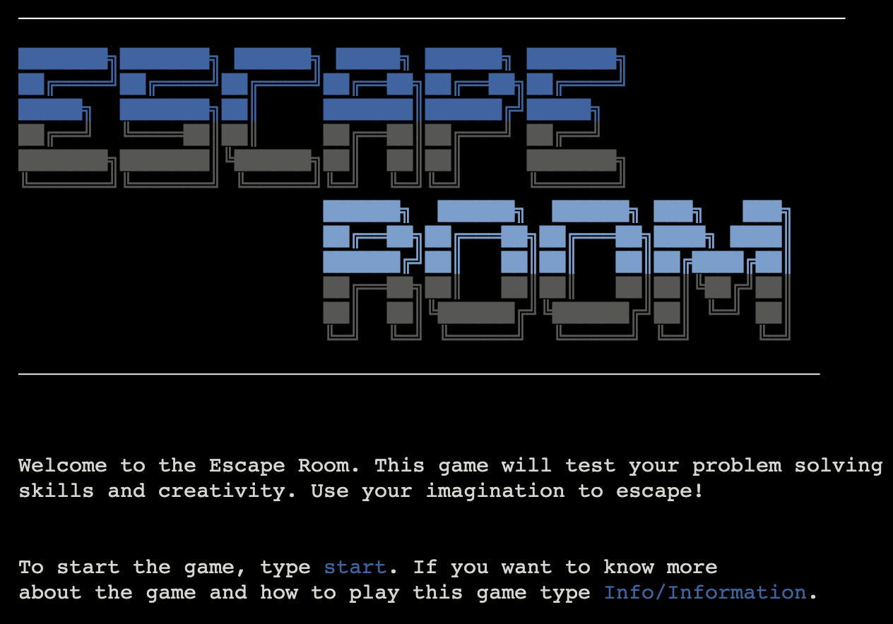

# The Escape Room

This Escape Room Game is designed and created to test the players investigative and creativity skills. 
The idea of this escape room game is to give the user as much freedom as as possilbe. This means that the player can
type anything in the command and there should be a response. The commands should at least be related to the current 
situation in game.

The player will look around the room to find a key/code to use to escape the room. There is also tips and hints available for the
player to ask for when they are stuck.

If you have every player Larry... almost the same.

The game can be played [here](https://quack-escape-room.herokuapp.com/)

# Table Of Contents

1. [User Experience (UX)](#user-experience-ux)
    * [Project Goals/User Goals](#project-goalsuser-goals)
    * [Color Scheme](#color-scheme)
    * [Flowchart](#flowchart)
2. [Features](#features)
3. [Technologies Used](#technologies-used)
    * [Languages](#languages-used)
    * [Frameworkds, Libraries, Website and Programs](#frameworks-libraries-websites-and-programs-used)
4. [Testing](#testing)
    * [Responsive Test](#responsive-test)
    * [Validating The Code](#validating-the-code)
    * [Accessibility](#accessibility)
5. [Deployment](#deployment)
6. [Credits](#credits)
7. [End Product](#end-product)

# User Experience (UX)
[Back To Top](#the-escape-room)  
[Back To Table Of Contents](#table-of-contents)

The Escape Room is created and designed in such a way the the user has as much freedom as possiple. The game is also colorful to make it pleasing for the player to look at, without being overwhelmed with too much color and distractions.
There might not be too many instructions, but the reason is so the player can have the freedom to type what they want.

## Project Goals/User Goals

* Have appealing features and is pleasing to look at.
* Application should keep running till player excecutes the app.
* Have many scenorios to cover as many different commands as possible.
* Have input validation for any incorrect inputs.
* As a player, I want as much freedom as possible to give any command and still get a scenario based on said command.
* As a player, I want to feel in control of the situations.

## Color Scheme

[Colorama](https://pypi.org/project/colorama/) was used to apply the color to most of the terminal text. I also colored the text in the terminal with the ANSI Escape sequences to get colors that wasn't available with Colorama. 
 

[This website](https://stackabuse.com/how-to-print-colored-text-in-python/) does a good job on explaining on how to use the ANSI Escape sequences.

## Flowchart

I don't really have a flowchart, but when I originally thought of the idea to create a escape room, I started creating diffirent possible scenarios on Notes on my Laptop. I adjusted/cahnged and added to the code as I started with the code.

    
Room Design

    
North Scenario

    
East Scenario

    
South Scenario

    
West Scenario

## Existing Features
    

    
Username

    Asks for a username and will be used through out the game. 
   

     

    
Direction Color

    When the user is looking into a direction, that direction will be in teh corresponding color.

     

    
Finish Aniamtion

    When the user finshes the game and esapes the room, a animation of playing rockets will play with a Congrats message after the animation.

 

# Technologies Used

[Back To Top](#my-perfect-holiday--safari)  
[Back To Table Of Contents](#table-of-contents)

## Languages Used
* [Python3](https://www.python.org/)  

## Frameworks, Libraries, Websites and Programs Used
* [GitPod](https://www.gitpod.io/)  
This website was used as a developers platform for writing code, committing the code and to push it to Github.  

* [Github](https://github.com/)  
This website is used to store code and make it possible for developers to commit and push code. This website also allows the Developer to share code with other developers.

* [Balsamiq](https://balsamiq.com/)  
This application was suggested by Code Institute to use for planning and creating a wireframe for the website.  

* [Text Generator](https://www.coolgenerator.com/ascii-text-generator)  
This website was used to generate the cool text that you see in the game. The two type of text I used was "Big" and "ANSI Shadow" 

* [Heroku](https://heroku.com)  
This was used to deploy the application.  
# Testing

[Back To Top](#my-perfect-holiday--safari)  
[Back To Table Of Contents](#table-of-contents)  

## Validating The Code
To validate the Python code, I used [Python Checker](https://www.pythonchecker.com/), because the original code validator that Code Institute reccomended was not available. 

    

        Python Validator
    

## Manual Testing

# Deployment

[Back To Top](#my-perfect-holiday--safari)  
[Back To Table Of Contents](#table-of-contents)  

[GitPod](https://gitpod.io/) Was used for the development of the website.  
[GitHub](https://github.com/) was used to Host and Deploy the the website.
The following steps was taking to Deploy the website via Github:

1. Creating the Repository
    * Log into Github.
    * Locate the template that was provided by Code Institute. [Template](https://github.com/Code-Institute-Org/gitpod-full-template)
    * Click on the "Use This Template" on the top of the Repository.
    * Enter the name that was chosen for the website.
    * Clicked on the "Create repository from Template" button.
2. Deploying the Website.
    * In the GitHub repository, click on the "Settings" Tab.
    * Navigate to the "Pages" subsection from the left hand pannel.
    * Select the "main" branch and select the "Save" button.
    * Now a link has been generated for the Live Website.
 

# Credits

[Back To Top](#my-perfect-holiday--safari)  
[Back To Table Of Contents](#table-of-contents)  

When creating the README File, multiple examples was used from other students to help with creating this README file.

### Suggested by my mentor
* [iKlevvv](https://github.com/iKelvvv/MS1)
* [Josswe26](https://github.com/josswe26/pura-vida-spa)

### Code Institute
* [Code Institute README](https://github.com/Code-Institute-Solutions/readme-template) 

### Fellow Slack Students
* [Dragon-fire-fly](https://github.com/dragon-fire-fly/venom/blob/main/README.md#testing)

## Codepen
CodePen is a social development environment for front-end designers and developers. Fellow Front-End Developers can use this website to help with certain code and features.  
The following code were used as inspiration with some of the features on the website:  

[Card Flip Feature](https://codepen.io/edeesims/pen/wvpYWW)  
[Back to top button on home page](https://codepen.io/JavaScriptJunkie/pen/pPRooV)

[Unsplash](https://unsplash.com/)  
All of the Images used on the website is from the website, Unsplash.  
 

# End Product

[Back To Top](#my-perfect-holiday--safari)  
[Back To Table Of Contents](#table-of-contents)  

Navigation Bar

 The Navigation bar is featured across all three pages and allows the user to navigate around the website using the Home, Activities and Contact Us links provided. The Navigation bar is identical on all three pages and this will allow for the user to navigate around with ease. The current page that is selected will be highlighted so the user will know on what page they currently are on.  

 

Landing Page

 The landing page includes a hero image that is the first image the user will see when the website opens. On the image is a short text that briefly tells the user what to expect about the website. AS the user scrolls down, they will see more information about the Travel Agency and what to expect about the website.  

 

Activities Page

On the Activities page, the user will be able to see what kind of activities are available to help build the perfect holiday. There are about 5 flip cards and each one will have a picture on the front of the card and when the user hovers over the card, it will flip around and reveal items related to the type of activities.
   

 

Contact Us Page

When the user go to the Contact Us Page, they will have two types of contact options. On the Left side of the page is a contact us Form that the user will be able to fill in and it will send the message to the Travel Agency. On The Right hand side of the website, there will be contact details that the user can use to contact the Travel Agency self. The map on the Contact Details shows the exact location and the map is interactive, and allows the user to zoom in, out and move it all about.
   
 

Footer

The Footer has a simple design that shows the social tags. Each tag links to the relative social media page and all links will open in a new tab and keep the current website open as well, this will make it easy for the user to navigate and the user would not have to worry about navigating back to the website. There is also an on hover effect on the social media links, it will change color, rotate and grow bigger.
   

  

