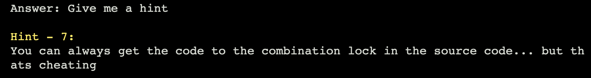
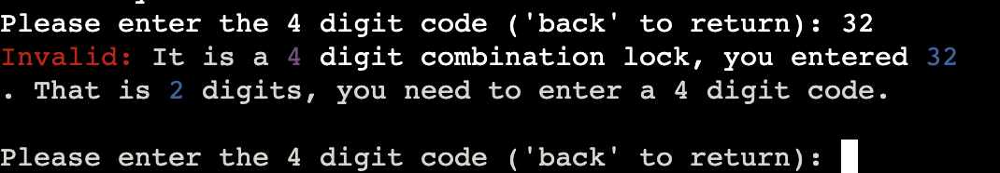

# The Escape Room

This Escape Room Game is designed and created to test the players investigative and creativity skills. 
The idea of this escape room game is to give the player as much freedom as as possilbe. This means that the player can
type anything in the command and there should be a response. The commands should at least be related to the current 
situation in game.

The player will look around the room to find a key/code to use to escape the room. There is also tips and hints available for the
player to ask for when they are stuck. As well as change directions by indicating what direction they want to face.

If you have every player Larry... almost the same.

The game can be played [here](https://quack-escape-room.herokuapp.com/)

# Table Of Contents

1. [User Experience (UX)](#user-experience-ux)
    * [Project Goals/User Goals](#project-goalsuser-goals)
    * [Color Scheme](#color-scheme)
    * [Flowchart](#flowchart)
2. [Features](#features)
3. [Technologies Used](#technologies-used)
    * [Languages](#languages-used)
    * [Frameworkds, Libraries, Website and Programs](#frameworks-libraries-websites-and-programs-used)
4. [Testing](#testing)
    * [Responsive Test](#responsive-test)
    * [Validating The Code](#validating-the-code)
    * [Accessibility](#accessibility)
5. [Deployment](#deployment)
6. [Credits](#credits)
7. [End Product](#end-product)

# User Experience (UX)
[Back To Top](#the-escape-room)  
[Back To Table Of Contents](#table-of-contents)

The Escape Room is created and designed in such a way the the player has as much freedom as possiple. The game is also colorful to make it pleasing for the player to look at, without being overwhelmed with too much color and distractions.
There might not be too many instructions, but the reason is so the player can have the freedom to type what they want.

## Project Goals/User Goals

* Have appealing features and is pleasing to look at.
* Application should keep running till player excecutes the app.
* Have many scenorios to cover as many different commands as possible.
* Have input validation for any incorrect inputs.
* As a player, I want as much freedom as possible to give any command and still get a scenario based on said command.
* As a player, I want to feel in control of the situations.

## Color Scheme

[Colorama](https://pypi.org/project/colorama/) was used to apply the color to most of the terminal text. I also colored the text in the terminal with the ANSI Escape sequences to get colors that wasn't available with Colorama. 
 

[This website](https://stackabuse.com/how-to-print-colored-text-in-python/) does a good job on explaining on how to use the ANSI Escape sequences.

## Flowchart

I don't really have a flowchart, but when I originally thought of the idea to create a escape room, I started creating diffirent possible scenarios on Notes on my Laptop. I adjusted/change and added to the code as I started with the code.

    
Room Design

    
North Scenario

    
East Scenario

    
South Scenario

    
West Scenario

 

# Features
[Back To Top](#the-escape-room)  
[Back To Table Of Contents](#table-of-contents)

## Existing Features
    

    
Username

    Asks for a username and will be used through out the game. 
   

     

    
Directions with Color

    When the player is looking into a direction, that direction will be in teh corresponding color.

     

    
Finish Animation

    When the player finshes the game and esapes the room, a animation of playing rockets will play with a Congrats message after the animation.

    
Tips

    Throughout any time in the game, the player will be able to ask for a tip and any 1 of the 10 tips will show, however... this will be a normal "Life Tip" and will have no meaning to the game. The reason for this is just for fun, because typically in a game a player will ask for a hint or ask for help. The Tips should show whenever the player uses the keyword "tip" or "tips".

    
Hints

    Throughout any time in the game, the player will be able to ask for a hint and any 1 of the 8 hints will show, these hints should be able to help the player progress through the game if the player is stuck at any time/place. The hints should show anytime the player uses the keywords "help", "hint", "hints", "idk" and even "i dont know".

    
Death Scenario

    Now I know that this might seem a little dark, but when I first started with creating the game and asked my brother to test the game so I can see where to make changes and fix bugs, the first thing he typed was "die" as a joke and my entire code crashed... So now I have a scenario for cases just like this.

 

# Technologies Used

[Back To Top](#the-escape-room)  
[Back To Table Of Contents](#table-of-contents)

## Languages Used
* [Python3](https://www.python.org/)  

## Frameworks, Libraries, Websites and Programs Used
* [GitPod](https://www.gitpod.io/)  
This website was used as a developers platform for writing code, committing the code and to push it to Github.  

* [Github](https://github.com/)  
This website is used to store code and make it possible for developers to commit and push code. This website also allows the Developer to share code with other developers.
I should also note, that I have 2 accounts on Github, a personal account (Quack842) and a work account (Nici-shad). For some reason, all the changes and editing I've done kept being uploaded via the work account, even though I am logged into my personal account on VS Code and on Github.

* [Balsamiq](https://balsamiq.com/)  
This application was suggested by Code Institute to use for planning and creating a wireframe for the application.  

* [Text Generator](https://www.coolgenerator.com/ascii-text-generator)  
This website was used to generate the cool text that you see in the game. The two type of text I used was "Big" and "ANSI Shadow" 

* [Heroku](https://heroku.com)  
This was used to deploy the application.  

* [Visual Studio Code](https://code.visualstudio.com/)  
This application is a very popular developers platform to create/commit/push and pull code. I first started this project with Gitpod, but moved to VS Code.  

* [HubSpot](https://blog.hubspot.com/sales/famous-quotes)  
This is where I got the 10 random quotes for when the player ask for a tip instead of a hint. 

 

# Testing

[Back To Top](#the-escape-room)  
[Back To Table Of Contents](#table-of-contents)  

## Validating The Code
For validating the Python code, I used [Python Checker](https://www.pythonchecker.com/).

## Manual Testing

Featrue             | Outcome                            | Example                                                     | Pass/Fail  |
:------------------:|:----------------------------------:|:-----------------------------------------------------------:|:----------:
Unreconized Commands|Validates command is unreconized    |       |Pass        |
Name Input          |Validates If vl is too short/empty  ||Pass        |
Name Input          |Validates If vl is too long         ||Pass        |
Name Input          |Validates If vl is a number         |   |Pass        |
Name Input          |Validates If vl is a symbol         |  |Pass        |
Padlock Code        |Validates if code is too short      |           |Pass        |
Padlock Code        |Validates if code is too long       |             |Pass        |
Padlock Code        |Validates if code is not a number   |          |Pass        |   
Padlock Code        |Validates if code is incorrect      |                 |Pass        |
                    

# Deployment

[Back To Top](#the-escape-room)  
[Back To Table Of Contents](#table-of-contents)  

The application has been deployed using [Heroku](https://heroku.com) by following these steps:

1. Push all the changes to GitHub.
2. Go to the Heroku's website.
3. Log into Heroku 
4. From the Heroku dashboard, click on "Create new app".
5. Enter the "App name" and "Choose a region" before clicking on "Create app".
6. Go to "Config Vars" under the "Settings" tab.
7. Add the Config Var, KEY: PORT and VALUE: 8000.
8. Go to "Buildpacks" section and click "Add buildpack".
9. Select "python" and click "Save changes", and doing the same for "node.js"
10. Go to "Deployment method", under the "Deploy" tab select "GitHub" and click on "Connect to GitHub".
13. Go to "Connect to GitHub" section and "Search" the repository to be deployed.
14. Click "Connect" next the repository name.
15. Choose "Manual deploys" to deploy your application manually.

# Credits

[Back To Top](#the-escape-room)  
[Back To Table Of Contents](#table-of-contents)  

The idea to give the player as much freedom as possiple came from the old game Larry.

And also to my family who helped me test the code over and over since no one on Slack helped. 